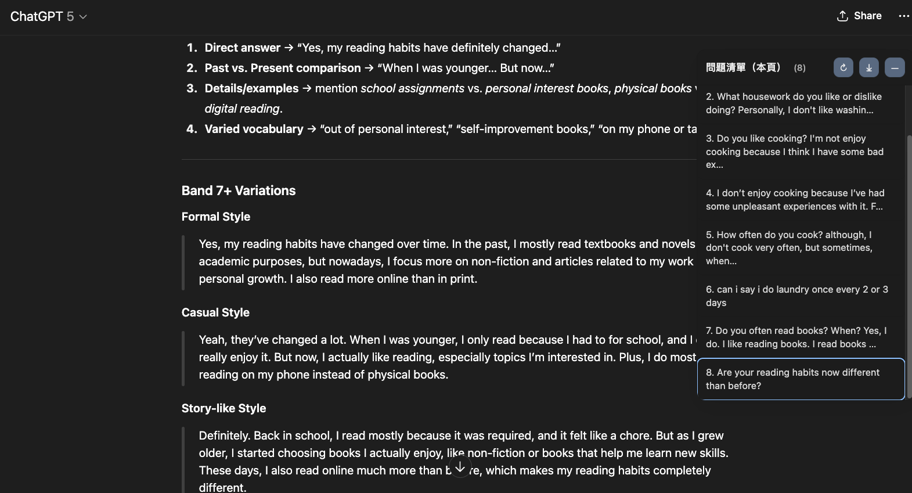

# ChatGPT TOC (Table of Contents)

A Chrome extension that adds a **sidebar Table of Contents** for your ChatGPT conversations.
It extracts all **user questions** from the current thread and displays them as a clickable list — so you can quickly jump back to any question in long conversations.

✨ **Features**

* 📜 Sidebar with a list of your questions (updates automatically).
* 🔍 Works even in **long conversations** (handles ChatGPT’s virtualized message list).
* 🎨 Dark mode friendly.
* 📋 Export your questions to **Markdown** (one-click copy).
* 🎯 Click any question to smoothly scroll to it and highlight it.

---

## 🔧 Installation

1. Clone or download this repository.

   ```bash
   git clone https://github.com/P76071226/ChatGPT-TOC.git
   cd chatgpt-toc
   ```

2. Open **Google Chrome** and go to:
   `chrome://extensions/`

3. Enable **Developer Mode** (top right corner).

4. Click **Load unpacked** and select the project folder (`chatgpt-toc`).

5. Open [ChatGPT](https://chat.openai.com) (or [chatgpt.com](https://chatgpt.com)), refresh the page — the **sidebar will appear**.

---

## 🖱️ Usage

* The sidebar shows all your **user messages/questions** in the current chat.
* Click a question → the page scrolls to that message and briefly highlights it.
* Use ↻ button to **force refresh**.
* Use ⤓ button to **export questions** to Markdown.
* Use — button to **collapse the sidebar**.

---

## ⚙️ How It Works

ChatGPT uses:

* A **scroll container** (not `window`)
* **Virtualized lists** (not all messages are in DOM at once)
* **SPA routing** (URL changes without page reload)

This extension solves those by:

* Locating the correct scroll container.
* Using **auto-scroll search** to load & jump to off-screen messages.
* Watching DOM mutations + URL changes.
* Periodic polling to stay up-to-date.

---

## 📸 Screenshots



---

## 🛠 Development

* Code lives in:

  * `manifest.json` – Chrome extension manifest
  * `content.js` – logic (scanning messages, building sidebar, auto-scroll)
  * `styles.css` – styling (light/dark mode, highlight, sidebar layout)

To make changes:

1. Edit files.
2. Reload extension in `chrome://extensions`.
3. Refresh ChatGPT tab.

---

## 🚧 Known Issues / Limitations

* ChatGPT’s UI changes often → selectors may need updates.
* Works best in desktop Chrome. (Not tested in Firefox or Edge).
* If a message can’t be found, try clicking ↻ to refresh the list.

---

## 📜 License

MIT License – free to use, modify, and share.

---

